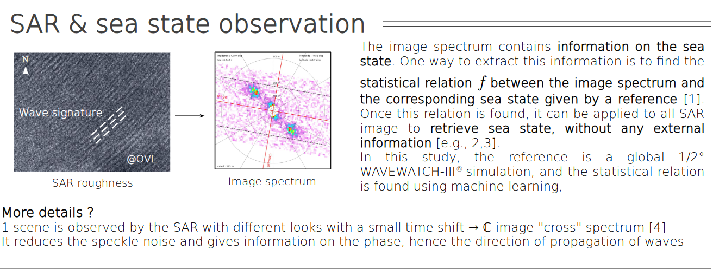
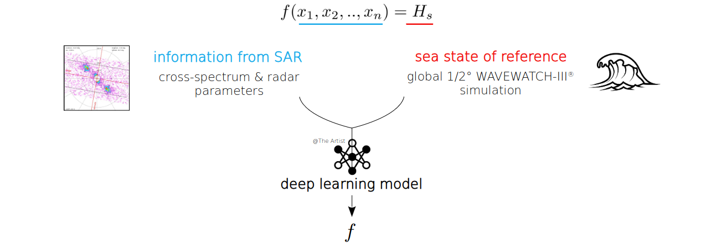

.. _atbd:

Algorithm Description
#####################

This page stands as the Algorithm Technical Baseline Description (A.T.B.D.) for Ifremer Sentinel-1 SAR Level-2 WAV product.

Data used as input is described in :cite:t:`topsar` and :cite:t:`level1sar`.
The algorithm is based on previous works: :cite:t:`hasselmann1991nonlinear`, :cite:t:`garello2001wave`
but also :cite:t:`krogstad1992simple`,  :cite:t:`li2010ocean` :cite:t:`li2019new`
It is a algorithm that could be compared to: :cite:t:`pleskachevsky2019estimation`, :cite:t:`PleskachevskyEtAlIJRS2019` :cite:t:`pleskachevsky2022multiparametric` applied to GRD SAR images.
Inputs features are derived following methodology described in :cite:t:`schulz2007empirical`.
Previous works on WV have been published in stopa2017significant , :cite:t:`QuachEtAlIEEETGRS2021`
