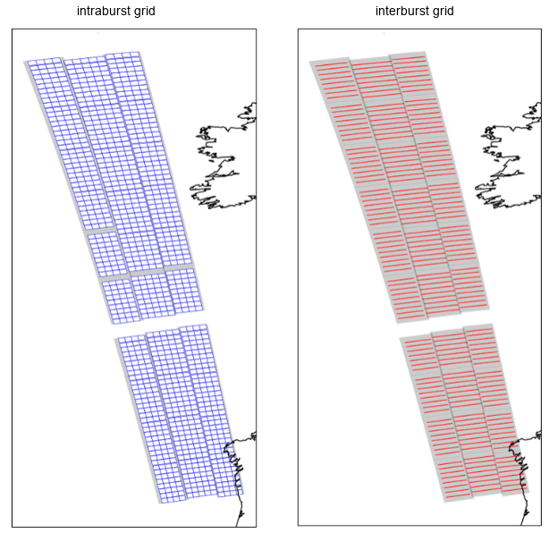
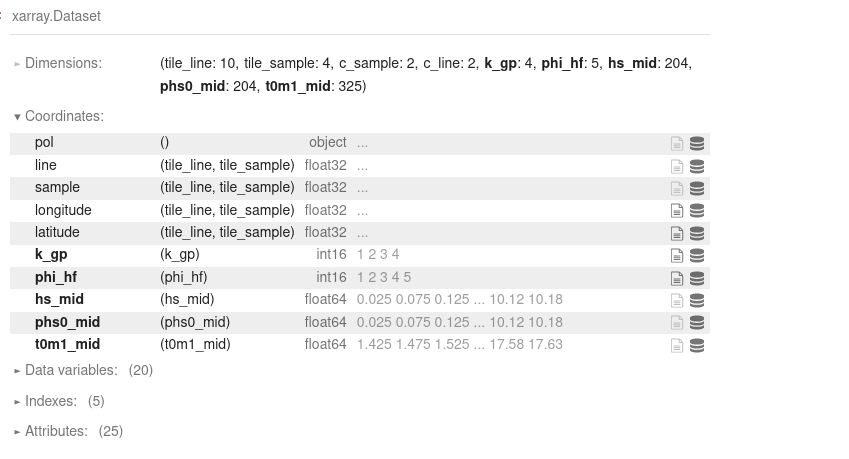
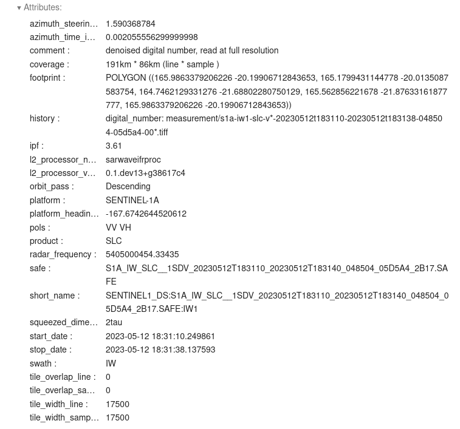
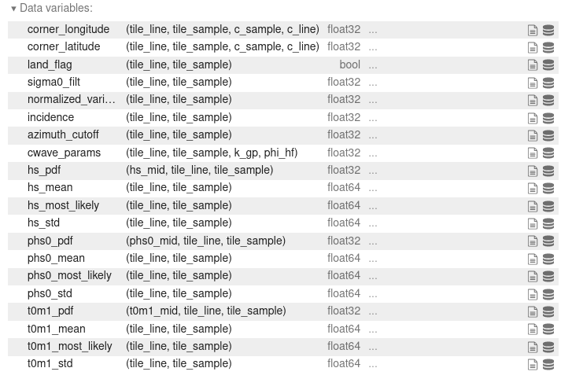

.. _productdescription:

Ifremer SARWAVE Level-2 WAV Product Description
###############################################

This page serves as the Product Description document for the **Sentinel-1 SARWAVE Level-2 WAV** product developed by Ifremer.
It outlines the filename structure, product organization, format, and content of the Level-2 SARWAVE product.

Product Philosophy
------------------

The organization of the SARWAVE product follows the ESA Level-1 SLC and SARWAVE Level-1B approach but contains geophysical parameter as the main information.
Each Level-1 SLC product corresponds to one Level-2 product, and each subswath is processed independently.
Within each subswath, geophysical information is retrieved on two different grids to optimize the information extracted from the Level-1 SLC product.

The geophysical parameters are thus retrieved on these two grids with the same resolution and sampling.
The main difference with respect to Level-1 SLC or Level-1B products is that at Level-2 stage, the concept of polarization channel does not exist anymore - indeed the two polarization channels can be combined together to produce a given geophysical quantity.

The variables are always the same from a product to another independently of the land flag value.
The number of files (ie subswath) per SAFE is always the same from a product to another independently of the land flag value.
The geophysical variables on land are filled with NaN (fill-values) while "radar" variables are always defined with meaningful values.
A slice completely on land would be produced even if it contains only fill-values.

Product naming conventions
--------------------------

SAFE naming convention
~~~~~~~~~~~~~~~~~~~~~~

Each product is stored in a .SAFE directory. The SAFE convention is inherited from Sentinel-1 mission and in particular from the Level-1 SLC. The SLC (single look complex) acronym has been replaced by WAV (for waves as the main goal of the product is to provide sea state parameters).

Each .SAFE directory contains only netCDF files.

There is one SAFE file per slice and one .nc file per sub-swath.

There are 3 netCDF files for IW and 5 for EW. For WV there are as many netCDF files are measurement in the Level-1 SLC product.

The netCDF naming convention is also very close to the ESA convention for the naming of the measurement files including in the Level-1 SLC .SAFE directories.

An example of L2 WAV filename is

.. code-block::

    S1A_IW_WAV__2SDV_20231103T063230_20231103T063257_051049_0627C3_C45D_E00.SAFE

, where :math:`E00` define a product version, it means: a processor version + options of processing

measurement naming convention
~~~~~~~~~~~~~~~~~~~~~~~~~~~~~
An example of L2 WAV measurement filename is

.. code-block::

    l2-s1a-iw1-wav-dv-20231103t063230-20231103t063255-051049-0627c3-e00.nc

where :math:`l2` gives the processing level, :math:`wav` describe the product family; :math:`dv` the polarization configuration for the acquisition (independently of how the channels are used in the file itself).
:math:`e00` is a product version, it means: a processor version + options of processing. The same are the one given at the end of the SAFE name.

Product organisation
--------------------

For a specific slice and subswath, the two grids (defined during the processing of Level-1 SLC products into Level-1B products) on which are retrieved the Level-2 geophysical parameters are:

     - **intraburst** grid is defined by a set of tiles within each burst. Several looks are then extracted, and associated cross-spectra are computed from these looks. The maximum tile size is approximately 17 by 17 km, depending on the processing parameters.
     - **interburst** grid is defined by a set of tiles that match the overlapping area between two adjacent bursts. The signals from these two bursts are then used as two different looks to compute cross-spectra. The maximum tile size is about 2 km (azimuth) by 17 km (range), depending on the processing parameters.

Figure \ref{fig:level2_variables_grids} illustrates the two grids for a set of 10 consecutive Level-2 products.
Geopĥysical parameters are estimated independently for all tiles on the two grids

Information related to these two grids are stored into two different groups : \textbf{intraburst} and \textbf{interburst} groups. Each group is defined by a specific set of attributes and variables.

intraburst group
~~~~~~~~~~~~~~~~

Attributes
==========

Variables
=========

intraburst group
~~~~~~~~~~~~~~~~

Attributes
==========

Variables
=========

.. image:: ./figures/variables_inter.png
  :alt: vinter
  :scale: 100 %
  :name: vinter
  :align: center

Product access
--------------

Currently the Level-2 SARWAVE Sentinel-1 product is disseminated from this URL:

https://cerweb.ifremer.fr/datarmor/sarwave/diffusion/sar/iw/slc/l2/

Acknowledgment
--------------

The Sentinel-1 Level-2 SARWAVE Product has been developed by Ifremer. This work is co-funded by ESA through the SARWAVE project (https://www.sarwave.org/).
The processor development benefits from support and contributions from Sentinel-1 Mission Performance Cluster team (https://sar-mpc.eu/about/activities-and-team/).